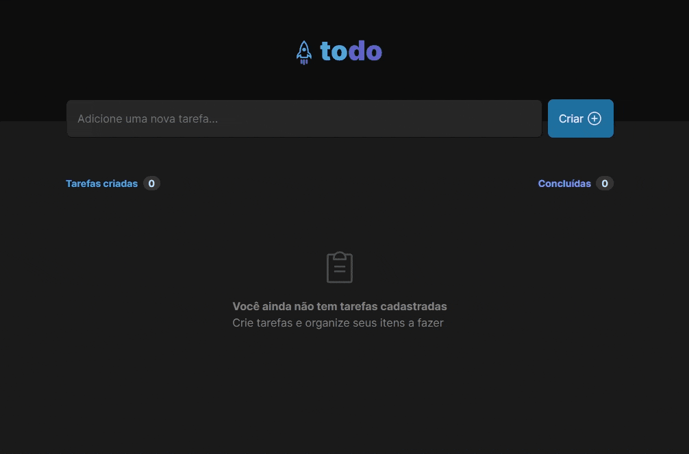

<p align="center">
  
</p>

<p align="center">
    <strong>Aplicativo web de todo list.</strong>
</p>

<p align="center">
  
  
  
  
</p>

<p align="center">
 <a href="#-sobre-o-projeto">Sobre</a> •
 <a href="#-funcionalidades">Funcionalidades</a> • 
 <a href="#-layout">Layout</a> • 
 <a href="#-tecnologias-utilizadas">Tecnologias</a> • 
 <a href="#-instalação-e-uso">Instalação</a> • 
 <a href="#-licença">Licença</a>
</p>

<h4 align="center"> 
	🚧  Projeto concluído 🚀 🚧
</h4>

## 💻 Sobre o projeto

Todo App foi criado para resolução do desafio do curso Ignite (trilha atualizada) da Rocketseat. Essa aplicação apesar de simples é um excelente exemplo para praticar o desenvolvimento de apps CRUD (Create, Read, Update, Delete).

<p align="center">
  
</p>


## ☑ Funcionalidades

- [x] Inserir tarefas
  - [x] Inserção com enter
  - [x] Verificação de campo vazio
- [x] Alterar estado da tarefa
  - [x] Marcar como concluído
  - [x] Apagar tarefa
- [x] Responsividade em telas menores
  - [x] Redução do tamanho de fonte
  - [x] Redução do tamanho de elementos
- [x] Navegação total por teclado


## 🎨 Layout

### Desktop

<p align="left"> 
  
</p>

### Mobile

<p align="left">       
  
  
</p>

## 🔨 Tecnologias utilizadas

As seguintes ferramentas foram usadas na construção do projeto:

- **[ReactJS](https://reactjs.org/)**
- **[TypeScript](https://www.typescriptlang.org/)**
- **[Sass](https://sass-lang.com/)**
- **[Vite](https://vitejs.dev/)**

> Veja o arquivo [package.json](https://github.com/mateusabelli/ignite-todo-app/blob/main/package.json)


## 🚀 Instalação e uso

```bash
# Clone o repositório
git clone https://github.com/mateusabelli/ignite-todo-app.git

# Acesse a pasta do projeto
cd ignite-todo-app

# Instale as dependências
npm install

# Execute a aplicação
npm run dev

# O servidor inciará na porta:3000 - acesse http://localhost:3000
```


## 📝 Licença

<a href="https://opensource.org/licenses/MIT">
    
</a>

Esse projeto está sob a licença MIT. Veja o arquivo [LICENSE](./LICENSE) para mais detalhes.

---

Feito com 💜 por [Mateus Abelli](https://github.com/mateusabelli)
